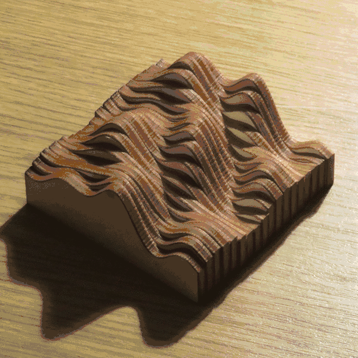
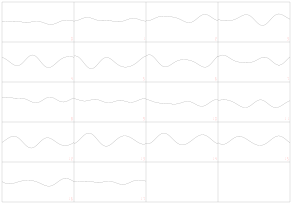

# sliced-wave-addon
This Blender Add-on can generate interactively configured models of a sliced wave sculpture and can export them as laser cutter templates in SVG.

## Installation

In order to install the addon, download the repository as a zip file and then install and enable it via the [Add-ons tab][add-ons tab] in the Blender [User Preferences][user preferences]. 

## Usage

To create a Sliced Surface, either select Add/Mesh/Add Sliced Surface or search for "Add Sliced Surface" in the [Toolbox][toolbox] (Hotkey: Spacebar). This will create a sliced surface which can be edited over the [Toolshelf tab][tabs and panels] in object mode (Hotkey: T). The various surface settings define the wave pattern as well as the resolution and number of slices. The export SVG settings define the dimensions (in mm) for the SVG template as well as the size of the canvas for the laser cutter template.

After selecting the desired settings and dimension, the model can be exported as a SVG template. The model in the animation was cut with a [GCC Spirit GLS][gcc spirit gls] laser cutter, where the line strengths needed to be set to "Hairline" in CorelDRAW in order to be recognized by the printer. Also keep in mind that the numbering (in red in the SVG) needs to be engraved by using a different settings for the laser cutter. The exported template can look like this

# License 
This project is licensed under the MIT license. See the [LICENSE](LICENSE) for details.

[add-ons tab]: https://docs.blender.org/manual/en/dev/preferences/addons.html
[user preferences]: https://docs.blender.org/manual/en/dev/preferences/introduction.html#open-user-preferences
[toolbox]: https://wiki.blender.org/index.php/Doc:2.4/Reference/Menus/Toolbox
[tabs and panels]: https://docs.blender.org/manual/en/dev/interface/window_system/tabs_panels.html
[gcc spirit gls]: http://www.gccworld.com/goods.php?act=view&no=20
